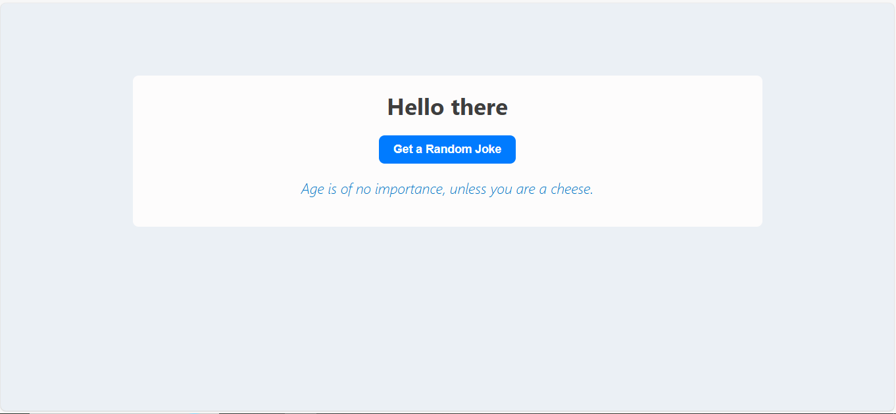
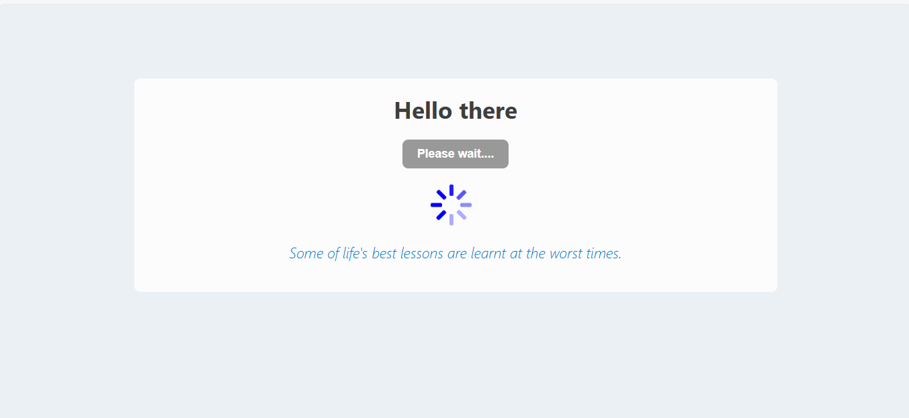
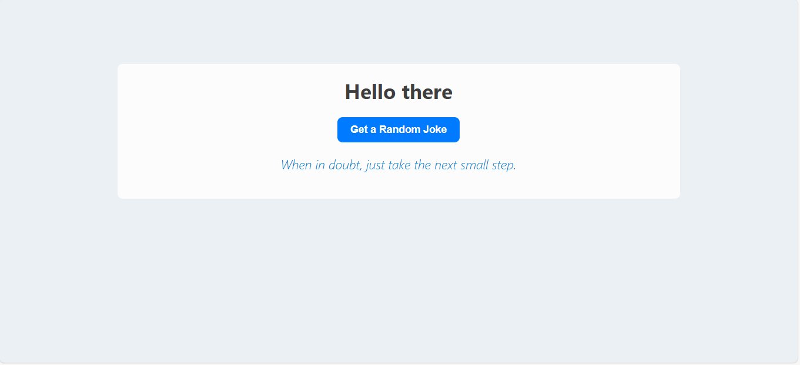

# React Advice App

A simple React application that fetches and displays random pieces of advice using the [Advice Slip API](https://api.adviceslip.com/). Focus to learn data fetching, React hooks, conditional rendering, and responsive design.

## Features

- Fetch a random piece of advice from an API
- Show a loading spinner while fetching advice
- Show error messages if the fetch fails
- Skip the spinner during the initial page load
- Fully responsive and mobile-friendly layout

## Technologies Used

- React (with `useState` and `useEffect`)
- JavaScript
- CSS in styling
- [React Spinners](https://www.davidhu.io/react-spinners/) for the loading animation

## Installation and Setup

1. **Clone the repo**

```bash
  git clone https://github.com/your-username/react-advice-app.git
```

2. **Navigate to the project folder**

```bash
cd react-advice-app
```

3. **Install dependencies**

```bash
npm install
```

4. **Start the development server**

```bash
npm start
```

# Screenshots

On load



Loading



Final output after loading



## Author

Made by [Brian Njoroge](https://github.com/briannjoroge) with ❤ .
